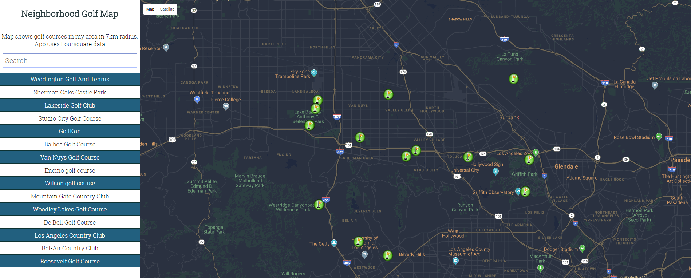

# Golf Neighborhood Map Project

## Table of Contents

* [Link to app on heroku](#app-link)
* [App Preview](#app-preview)
* [Description of app](#description)
* [Running the app](#running-the-project)
* [How to use this app](#how-to-use-this-app)
* [Technology used](#technology-used)
* [Thank you](#thank-you)

## Live deployment

https://itodorovic.com/golfneighborhoodmap/

## App Preview

## Description

A single-page application featuring a map of my neighborhood in Los Angeles. Map displays golf courses markers by default, and displays the filtered subset of location markers when a user search filter is applied. Text input field should be used to filter the locations.

## Running the Project

Download compressed project folder or clone the repo, `git clone https://github.com/Igor333m/neighborhoodmap.git`

First run `npm install` in command prompt / terminal

Then run `npm start` to start the app

## How To Use This App

Click the location markers on the map to see the golf course image retrieved from Foursquare API and its location

Or use the search box to type the golf course name and see location on the map

## Technology Used

* React
* React-debounce-input / https://www.npmjs.com/package/react-debounce-input
* Google Maps API
* Foursquare API

## Thank You

## Udacity 

For this amazing experience
